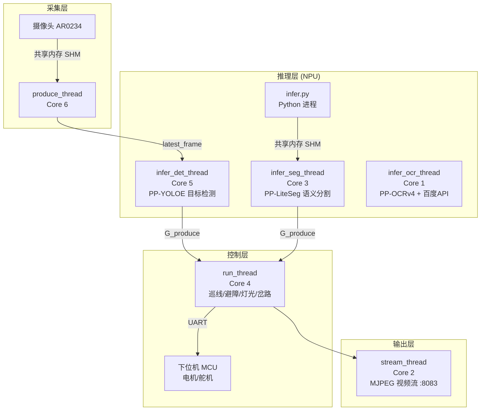
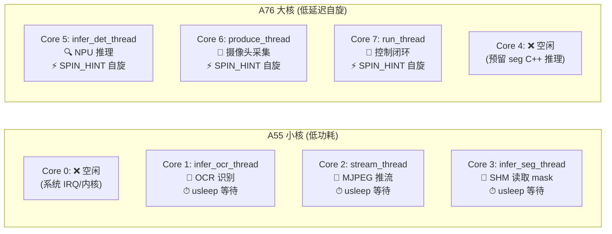
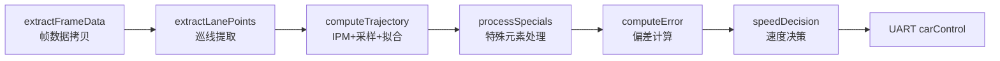
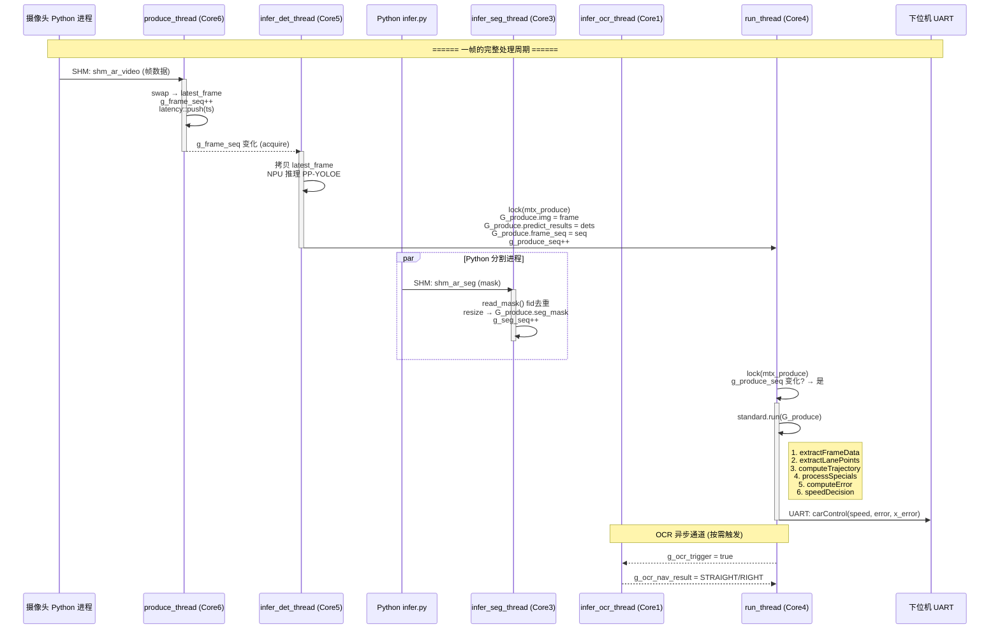

# ICAR 项目代码架构文档

> **项目名称**: `icar` — 基于 RK3588 的智能车自动驾驶系统  
> **平台**: Rockchip RK3588 (ARM big.LITTLE: 4×A76 + 4×A55)  
> **C++ 标准**: C++17, 编译优化 `-O3 -mcpu=native -flto`  
> **版本**: Model_21-7.8_gold_debug

---

## 目录

1. [整体架构概览](#1-整体架构概览)
2. [多线程流水线架构](#2-多线程流水线架构) ⭐
   - [2.1 线程全景](#21-线程全景)
   - [2.2 CPU 亲和性策略](#22-cpu-亲和性策略)
   - [2.3 同步机制](#23-同步机制)
3. [各线程详细剖析](#3-各线程详细剖析) ⭐
   - [3.1 produce_thread — 采集线程](#31-produce_thread--采集线程)
   - [3.2 infer_det_thread — 目标检测线程](#32-infer_det_thread--目标检测线程)
   - [3.3 infer_seg_thread — 语义分割线程](#33-infer_seg_thread--语义分割线程)
   - [3.4 infer_ocr_thread — OCR 语义导航线程](#34-infer_ocr_thread--ocr-语义导航线程)
   - [3.5 run_thread — 核心控制线程](#35-run_thread--核心控制线程)
   - [3.6 stream_thread — 视频推流线程](#36-stream_thread--视频推流线程)
4. [数据流与流水线时序](#4-数据流与流水线时序) ⭐
   - [4.1 端到端数据流图](#41-端到端数据流图)
   - [4.2 关键数据路径延迟分析](#42-关键数据路径延迟分析)
   - [4.3 帧同步与掉帧处理](#43-帧同步与掉帧处理)
   - [4.4 同步开销分析](#44-同步开销分析)
5. [模块详细说明](#5-模块详细说明)
6. [配置系统](#6-配置系统)
7. [构建系统](#7-构建系统)
8. [启动流程](#8-启动流程)
9. [目录结构](#9-目录结构)

---

## 1. 整体架构概览

本项目是一个基于 RK3588 NPU 的**智能车自动驾驶系统**，采用**生产者-消费者多线程流水线**架构。系统从摄像头采集实时视频，通过 NPU 进行目标检测（PP-YOLOE）和语义分割，再经由控制算法实现巡线、避障、岔路导航、红绿灯识别等自动驾驶功能。



---

## 2. 多线程流水线架构

### 2.1 线程全景

系统在 `main()` 中同时启动 **6 个线程**，构成一条完整的**生产者-消费者流水线**。所有线程共享一个全局 `Produce` 结构体 `g_produce` 作为数据载体：

```cpp
// main.cpp — 线程创建
std::thread produce_t(&produce_thread, std::ref(g_produce), std::cref(config));
std::thread infer_det_t(&infer_det_thread, std::ref(g_produce), std::cref(config));
std::thread infer_seg_t(&infer_seg_thread, std::ref(g_produce), std::cref(config));
std::thread infer_ocr_t(&infer_ocr_thread, std::ref(g_produce), std::cref(config));
std::thread run_t(&run_thread, std::ref(g_produce), std::cref(config));
std::thread stream_t(&stream_thread, std::ref(g_produce));
```

| 线程 | 绑定 CPU | 角色 | 数据生产者 | 数据消费者 |
|------|----------|------|------------|------------|
| `produce_thread` | **Core 6** (A76) | 🎥 采集 | 摄像头 SHM | `infer_det_thread` |
| `infer_det_thread` | **Core 5** (A76) | 🔍 目标检测 | `produce_thread` | `run_thread` |
| `infer_seg_thread` | **Core 3** (A55) | 🧩 语义分割 | Python `infer.py` SHM | `run_thread` |
| `infer_ocr_thread` | **Core 1** (A55) | 📖 OCR 导航 | `run_thread` (通过 `g_ocr_trigger`) | `run_thread` (通过 `g_ocr_nav_result`) |
| `run_thread` | **Core 4** (A76) | 🧠 核心控制 | 检测 + 分割线程 | MCU (UART)、`stream_thread` |
| `stream_thread` | **Core 2** (A55) | 📡 视频推流 | `run_thread` (通过 `G_produce`) | HTTP 客户端 |

### 2.2 CPU 亲和性策略

RK3588 采用 ARM big.LITTLE 架构，本项目利用 `pthread_setaffinity_np` 将线程固定到特定核心：

```cpp
// thread.cpp & ocr_thread.cpp 中的绑核宏
#define PIN_TO_CORE(core)                                          \
    do {                                                           \
        cpu_set_t cpu;                                             \
        CPU_ZERO(&cpu);                                            \
        CPU_SET(core, &cpu);                                       \
        pthread_setaffinity_np(pthread_self(), sizeof(cpu), &cpu); \
    } while (0)
```



**分配原则**:
- **大核 (A76)** 分配给实时性要求最高的 **采集、推理、控制** 线程
- **小核 (A55)** 分配给 **非实时** 或 **轻量** 任务（推流、SHM 轮询、OCR）
- Core 0 空闲，留给 Linux 内核处理中断和系统任务
- Core 7 空闲，为未来扩展预留

### 2.3 同步机制

系统使用多种同步原语协调线程间数据传递：

| 同步变量 | 类型 | 生产者 → 消费者 | 说明 |
|----------|------|-----------------|------|
| `mtx_frame` | `std::mutex` | produce → infer_det | 保护 `latest_frame` 读取 |
| `g_frame_seq` | `std::atomic<uint64_t>` | produce → infer_det | 帧版本号，检测线程据此判断新帧就绪 |
| `mtx_produce` | `std::mutex` | infer_det/seg → run/stream/ocr | 保护 `G_produce` 写入 |
| `g_produce_seq` | `std::atomic<uint64_t>` | infer_det → run/stream | 检测结果版本号 |
| `g_seg_seq` | `std::atomic<uint64_t>` | infer_seg → run | 分割 mask 版本号 |
| `g_ocr_trigger` | `std::atomic<bool>` | run → infer_ocr | OCR 触发信号（fire-and-forget） |
| `g_ocr_nav_result` | `std::atomic<int>` | infer_ocr → run | OCR 导航结果回传 |
| `mtx_draw` | `std::mutex` | run → stream | 可视化画线数据保护 |
| `g_exit` | `std::atomic<bool>` | main → 所有线程 | 全局退出信号 |
| `stop_flag` | `std::atomic<bool>` | stream(键盘) → run | 紧急停止标志 |

**等待策略**: 分两类：
- **大核关键线程** (produce/infer_det/run): 使用 ARM `YIELD` 指令自旋 (`SPIN_HINT()`)，唤醒延迟 ~1ns，消除 `usleep` 的 1-4ms 内核唤醒抖动
- **小核非实时线程** (seg/stream/ocr): 继续使用 `usleep`，省电且不影响关键路径

**为什么用 `g_frame_seq` 而不是条件变量？**
- 条件变量的 `notify_one` + `wait` 涉及内核态切换，开销约 10-50μs
- `atomic` 的 `load(acquire)` + `store(release)` 仅需 ~5-10ns
- 配合 `YIELD` 自旋，线程间通信延迟从 ~1000μs (usleep) 降到 ~1μs，帧率方差趋近于 0

---

## 3. 各线程详细剖析

### 3.1 `produce_thread` — 采集线程

**文件**: `src/thread/thread.cpp`  
**绑核**: Core 6 (A76 大核)  
**角色**: 流水线第一环，摄像头帧采集

```cpp
void produce_thread(Produce &G_produce, const Config &config)
{
    PIN_TO_CORE(6);
    while (!g_exit) {
        // 1. 从共享内存读取摄像头帧（内部深拷贝 RGB→BGR，不指向 SHM）
        cv::Mat out_img = get_realtime_frame("shm_ar_video", 3*640*480+16);
        // flip 已移至摄像头驱动侧，此处无需翻转
        if (out_img.empty()) { SPIN_HINT(); continue; }

        // 2. O(1) swap 写入 latest_frame — 锁内仅交换指针，<10ns
        {
            std::lock_guard<std::mutex> lock(mtx_frame);
            cv::swap(latest_frame, out_img);
            new_frame_seq = g_frame_seq.fetch_add(1, memory_order_release) + 1;
        }
        // 3. 记录时间戳（用于延迟测量）
        latency::push(new_frame_seq, now_us);
    }
}
```

**设计要点**:
- 使用 `cv::swap` 而非 `clone()`，避免 900KB 内存分配/拷贝
- 帧序号使用 `memory_order_release` 确保写入可见性
- 失败时 `usleep(500)` 避免 CPU 空转

---

### 3.2 `infer_det_thread` — 目标检测线程

**文件**: `src/thread/thread.cpp`  
**绑核**: Core 5 (A76 大核)  
**角色**: 流水线第二环，NPU 目标检测，线程中最耗时的环节

```cpp
void infer_det_thread(Produce &G_produce, const Config &config)
{
    PIN_TO_CORE(5);
    PpyoloeDetector detector;
    detector.load(config);
    
    while (!g_exit) {
        // 1. 等待新帧（ARM YIELD 自旋，唤醒延迟 ~1ns）
        if (g_frame_seq == last_frame_seq) { SPIN_HINT(); continue; }

        // 2. 拷贝 latest_frame（带锁）
        {
            std::lock_guard<std::mutex> lock(mtx_frame);
            out_img = latest_frame;  // 浅拷贝 + 引用计数，安全无撕裂
        }

        // 3. NPU 推理 → 11类检测结果
        detector.infer(out_img, detections);

        // 4. 写入全局共享区
        {
            lock_guard<mutex> lock(mtx_produce);
            G_produce.predict_results = detections;
            G_produce.img = out_img;
            G_produce.frame_seq = last_frame_seq;
            g_produce_seq.fetch_add(1, memory_order_release);
        }
    }
}
```

**设计要点**:
- 本线程持有全局唯一的 `PpyoloeDetector` 实例
- detect → 将结果写入 `G_produce` → `g_produce_seq++` 通知 `run_thread`
- 检测结果中 `frame_seq` 携带原始帧序号，控制线程可据此计算端到端延迟

---

### 3.3 `infer_seg_thread` — 语义分割线程

**文件**: `src/thread/thread.cpp`  
**绑核**: Core 3 (A55 小核)  
**角色**: 从 Python `infer.py` 进程的共享内存中读取分割 mask

```cpp
void infer_seg_thread(Produce &G_produce, const Config &config)
{
    PIN_TO_CORE(3);
    SegShmReader reader("shm_ar_seg", 3*640*480+16);  // 打开 SHM
    
    while (!g_exit) {
        // 1. 从 SHM 读取最新 mask（带 fid 去重）
        cv::Mat seg_img;
        if (!reader.read_mask(seg_img)) { usleep(2000); continue; }

        // 2. 缩放到与 latest_frame 相同的尺寸
        if (seg_img.size() != latest_frame.size())
            cv::resize(seg_img, seg_img, latest_frame.size(), 0, 0, INTER_NEAREST);

        // 3. 写入全局共享区
        {
            lock_guard<mutex> lock(mtx_produce);
            G_produce.seg_mask = seg_img;
            g_seg_seq.fetch_add(1, memory_order_release);
        }
    }
}
```

**设计要点**:
- 分割实为 Python 进程通过 SHM 完成，本线程仅做**数据搬运**
- 使用 `fid` (frame ID) 去重，避免处理重复帧
- 放小核是因为它只是轻量 SHM 轮询，不涉及重计算

---

### 3.4 `infer_ocr_thread` — OCR 语义导航线程

**文件**: `src/thread/ocr_thread.cpp`  
**绑核**: Core 1 (A55 小核)  
**角色**: fire-and-forget 模式，异步处理岔路识别

```cpp
void infer_ocr_thread(Produce &G_produce, const Config &config)
{
    PIN_TO_CORE(1);
    BaiduApi api;  // 百度千帆视觉 API
    
    while (!g_exit) {
        // 1. 等待触发
        if (!g_ocr_trigger.load(acquire)) { usleep(5000); continue; }
        if (g_ocr_nav_task_cnt >= config.ocr_max_tasks) continue;

        // 2. 从 G_produce 获取 branch_sign 检测框，裁剪图片
        cv::Mat crop = frame(bbox).clone();

        // 3. Base64 编码
        std::string img_b64 = mat_to_base64(crop);

        // 4. 调用百度视觉大模型 (30s 超时)
        auto future = std::async(launch::async, [&]{ return api.navigate_vision(img_b64); });
        if (future.wait_for(30s) == timeout) { result = RIGHT; }
        
        // 5. 解析结果 → 写入 g_ocr_nav_result
        g_ocr_nav_result.store(STRAIGHT or RIGHT);
    }
}
```

**通信模式**（fire-and-forget）:
```
run_thread                       infer_ocr_thread
    │                                  │
    │── g_ocr_trigger = true ────────→ │ 触发
    │── g_ocr_nav_result = PENDING ──→ │ 标记等待
    │                                  │ 裁剪→Base64→百度API (异步, 30s超时)
    │   (继续执行控制循环, 不阻塞)      │
    │                                  │
    │←── g_ocr_nav_result = STRAIGHT ──┤ 结果回传
    │   (下一帧读取)                    │
```

**设计要点**:
- 使用 `std::async` 异步 HTTP 调用，本线程不阻塞在 API 等待上
- `g_ocr_trigger` 是 atomic bool，控制线程写入后立即返回
- `g_ocr_nav_result` 枚举: `NONE(0) → PENDING(1) → STRAIGHT(2)/RIGHT(3)`
- 最多执行 `ocr_max_tasks` 次（默认 2 次）

---

### 3.5 `run_thread` — 核心控制线程

**文件**: `src/thread/thread.cpp`  
**绑核**: Core 4 (A76 大核)  
**角色**: 系统大脑，整个控制流水线的调度中心

```cpp
void run_thread(Produce &G_produce, const Config &config)
{
    PIN_TO_CORE(7);  // 独占大核，ARM YIELD 自旋
    Uart uart("/dev/ttyUSB0");
    Standard standard(config);

    while (!g_exit) {
        // 1. 等待新检测结果 — SPIN_HINT 自旋，延迟 <1μs
        if (g_produce_seq == last_produce_seq) { SPIN_HINT(); continue; }

        // 2. 调用控制流水线
        TaskData dst = standard.run(G_produce, global_speed, global_fps);

        // 3. UART 输出
        uart->carControl(dst.speed, dst.error, dst.x_error);
    }
}
```

**`Standard::run()` 内部流水线**:



**6 个子阶段详解**:

| 阶段 | 耗时 (~ms) | 功能 |
|------|-----------|------|
| `extractFrameData` | ~0.05 | 从 `G_produce` 拷贝帧、mask、检测结果（带锁） |
| `extractLanePoints` | ~2-5 | CV 巡线或 AI 分割巡线 + 形态学处理 |
| `computeTrajectory` | ~1-3 | IPM 逆透视变换 → 等距采样 → 轨迹拟合 (Gauss/LOWESS/Bezier) |
| `processSpecials` | ~1-8 | 岔路状态机 + 金币/车辆避障 + 行人决策 + 红绿灯 + STOP/GO |
| `computeError` | ~0.1 | 计算偏离中线误差、丢线恢复、动态预瞄距离 |
| `speedDecision` | ~0.05 | PID 速度控制 + 密集目标减速 + 模糊控制器叠加 |

**`processSpecials` 内部分发**（按检测类别路由）:

```
detections ──► class 4/5/6/7 ──► Light   ──► 红绿灯决策  (GO/CAUTION/STOP)
           ├─ class 8       ──► Objects ──► 金币避障+屏蔽
           ├─ class 10      ──► Objects ──► 车辆避障+屏蔽
           ├─ class 9       ──► Human   ──► 行人判断 → FuzzyHumanSpeedController
           ├─ class 2       ──► Branch  ──► 岔路状态机
           └─ class 0/1     ──► GoStop  ──► STOP/GO 标志牌 → segmask 填充
```

---

### 3.6 `stream_thread` — 视频推流线程

**文件**: `src/thread/thread.cpp`  
**绑核**: Core 2 (A55 小核)  
**角色**: MJPEG 视频流输出，纯展示用途，不影响控制闭环

```cpp
void stream_thread(Produce &G_produce)
{
    PIN_TO_CORE(2);
    MjpegStreamer streamer(8083, 10, 3000);  // 端口8083, JPEG质量10, 空闲3ms

    while (!g_exit) {
        // 1. 键盘轮询: q/h/e/ESC → 退出/停止
        MjpegStreamer::pollExitKey(g_exit, stop_flag);

        // 2. 等待新帧
        if (g_produce_seq == last_seq) { usleep(3000); continue; }

        // 3. 拷贝 G_produce（带锁）
        {
            lock_guard<mutex> lock(mtx_produce);
            produce_snapshot = G_produce;
        }

        // 4. 渲染: 检测框 + mask 叠加 + FPS 文字
        drawBox(stream_img, detections);
        cv::putText(stream_img, fps_text, ...);

        // 5. JPEG 编码 → HTTP MJPEG 推流
        cv::imencode(".jpg", stream_img, jpg, {IMWRITE_JPEG_QUALITY, 10});
        streamer.processFrame(stream_img);
    }
}
```

**设计要点**:
- 使用 **非阻塞 send**，慢客户端自动跳帧但不影响控制流水线
- 键盘输入通道：`q` 退出程序，`h`/`e`/`ESC` 紧急停止
- 放小核 + 低 JPEG 质量 (10) 保证推流不抢大核资源

#### 3.3.1 PP-YOLOE 目标检测 (`ppyoloe/`)

| 文件 | 功能 |
|------|------|
| `ppyoloe_detector.hpp/cpp` | RKNN 模型加载、推理、UDP 结果发送 |
| `ppyoloe_postprocess.hpp/cpp` | NMS 后处理、坐标解码 |
| `labels.txt` | 11 类标签（见下方 class_id 表） |

**检测类别映射**（`src/common/utils.hpp`）:

| class_id | 类别 | 处理模块 |
|----------|------|----------|
| 0 | STOP 标志牌 | `GoStop` |
| 1 | GO 标志牌 | `GoStop` |
| 2 | 岔路标志 (BranchSign) | `Branch` |
| 3 | 限速标志 (SpeedSign) | `Standard` |
| 4 | 绿灯 | `Light` |
| 5 | 红灯 | `Light` |
| 6 | 黄灯 | `Light` |
| 7 | 斑马线 (ZebraLine) | `Light` |
| 8 | 金币 (Gold) | `Objects` |
| 9 | 行人 (Human) | `Human` |
| 10 | 车辆 (Car) | `Objects` |

#### 3.3.2 PP-LiteSeg 语义分割 (`ppseg/`)

- **Python 进程** (`infer.py`): 独立 Python 进程运行 RKNN 分割推理，输出 mask 到共享内存
- **C++ 侧** (`ppseg_detector.hpp/cpp`): 通过共享内存读取分割 mask (SHM 名称: `shm_ar_seg`)
- 分割结果包含道路区域信息，用于巡线

#### 3.3.3 OCR 文字识别 (`ocr/`)

| 文件 | 功能 |
|------|------|
| `ocr_detector.hpp/cpp` | PP-OCRv4 RKNN 模型封装，CTC 贪心解码 |
| `ocr_api.hpp/cpp` | 百度千帆 API 语义导航（文字/视觉模式）|
| `navigator_api.py` | Python 版导航 API 客户端 |

OCR 流程：检测到岔路标志 → 裁剪路牌图像 → NPU OCR 识别 → 百度 API 判断"直行/右转"

### 3.4 `src/standard/` — 控制核心

| 文件 | 功能 |
|------|------|
| `standard.hpp/cpp` | **主控模块**: `Standard::run()` 编排完整控制流水线 |
| `general.hpp/cpp` | 通用工具: PID 控制、贝塞尔曲线、中值滤波、图像保存 |
| `fuzzy.hpp/cpp` | **模糊控制器**: 行人速度决策 (Mamdani 推理，COG 去模糊化) |

**`Standard::run()` 控制流水线**:

```
1. extractFrameData()      → 从 G_produce 拷贝帧数据
2. extractLanePoints()     → CV 传统巡线 / AI 分割巡线
3. computeTrajectory()     → IPM 变换 + 等距采样 + 轨迹拟合
4. processSpecials()       → 特殊元素处理 (灯光/金币/行人/车辆/岔路/STOP)
5. computeError()          → 偏差计算 + 丢线恢复
6. speedDecision()         → 速度决策 + 密集目标减速
7. UART 输出               → 向 MCU 发送 speed/error/x_error
```

### 3.5 `src/special/` — 特殊场景处理

| 模块 | 文件 | 功能 |
|------|------|------|
| **Branch** | `branch.hpp/cpp` | 岔路状态机 (NONE→DETECTED→AWAIT→FETCH→TURNRIGHT→IN→OUT→OVER) |
| **Objects** | `objects.hpp/cpp` | 金币/车辆避障、橡胶带曲线、障碍物屏蔽 |
| **Human** | `human.hpp/cpp` | 行人检测: 近/远区分、穿越判断、停车决策 |
| **Light** | `light.hpp/cpp` | 红绿灯识别: 绿/黄/红灯 → GO/CAUTION/STOP |
| **GoStop** | `go_stop.hpp/cpp` | STOP/GO 标志牌处理、掩码绘制、轨迹修正 |

### 3.6 `src/imgprocess/` — 图像处理

| 文件 | 功能 |
|------|------|
| `imgProcess.hpp/cpp` | 形态学处理: CV 传统方法 + AI 分割后处理 |
| `LineTracker.hpp/cpp` | 巡线提取: 蓝色箭头 (CV) / 语义分割 (AI) / 等距采样 |
| `transform.hpp/cpp` | 逆透视变换 (IPM): 图像坐标 ↔ 鸟瞰图坐标 |
| `TrajectoryFitter.hpp/cpp` | 轨迹拟合: 最小二乘/LOWESS/高斯/贝塞尔/高斯过程 |

### 3.7 `res/include/` — 外设与通信

| 文件 | 功能 |
|------|------|
| `video_get.hpp/cpp` | 共享内存视频帧读取 (SHM: `shm_ar_video`) |
| `mjpeg_streamer.hpp` | MJPEG HTTP 视频流服务器 (端口 8083) |
| `sendUART.hpp` | 串口通信协议: 速度/方向/蜂鸣器/LED |
| `sendUDP.hpp` | UDP 遥测数据发送 |
| `aiget.hpp` | UDP JSON 接收检测结果 (备用方案) |
| `control.hpp` | 电机控制接口封装 |
| `json.hpp` | nlohmann JSON 库 |
| `logger.hpp` / `ring_logger.hpp` | 日志/环形日志 |
| `stop.hpp` / `common.hpp` | 车辆停止/通用定义 |

### 3.8 `src/common/` — 公共工具

| 文件 | 功能 |
|------|------|
| `utils.hpp/cpp` | class_id 常量、数学工具宏、剪裁函数 |

### 3.9 `tools/` — 辅助工具

| 文件 | 功能 |
|------|------|
| `uart_dump.cpp` | 串口数据抓取调试工具 |

---

## 4. 数据流与流水线时序

### 4.1 端到端数据流图



### 4.2 关键数据路径延迟分析

每条数据路径的延迟构成如下表所示。延迟测量通过内置的 `LATENCY_MEASURE` 机制实现：`produce_thread` 在写入帧时记录 `frame_seq → timestamp_us` 到环形缓冲，`run_thread` 在处理完成后根据 `frame_seq` 查找对应时间戳计算端到端延迟。

```
路径1: 采集 → 控制 (端到端)
  produce_thread:   CAM SHM 读取               ~0.5ms
  infer_det_thread: 拷贝帧 + NPU 推理 + 后处理   ~5-15ms  ← 瓶颈
  run_thread:       standard.run() 全流程       ~3-10ms
  run_thread:       UART 发送                  ~0.2ms
  ─────────────────────────────────────────────────
  总延迟:                                       ~10-25ms

路径2: 分割 → 控制
  Python infer.py:  推理 + SHM 写入             ~15-30ms  ← Python 侧
  infer_seg_thread: SHM 读取 + resize           ~0.5ms
  run_thread:       巡线使用 seg_mask            (与路径1合并)

路径3: OCR → 控制 (异步, 不阻塞)
  infer_ocr_thread: 裁剪 → Base64              ~2ms
  infer_ocr_thread: 百度视觉 API HTTP 调用      ~1000-5000ms  ← 网络延迟
  run_thread:       读取 g_ocr_nav_result       下一帧生效
```

### 4.3 帧同步与掉帧处理

系统没有使用阻塞队列，而是采用**最新帧优先 (drop-old)** 策略：

| 场景 | 处理方式 |
|------|----------|
| 检测慢于采集 | `infer_det_thread` 跳过中间帧，只处理最新 `latest_frame` |
| 控制慢于检测 | `run_thread` 消费 `g_produce_seq` 最新帧，跳过旧结果 |
| 分割慢于控制 | `run_thread` 使用上帧 mask（`g_seg_seq` 未变时复用） |
| OCR 超时 | 30秒超时后 fallback 为 `RIGHT`，不阻塞岔路状态机 |
| 轨迹无效 | `run_thread` 丢线恢复：连续 >3 帧无效 → 偏航修正；>40 帧 → 停车 |

### 4.4 同步开销分析

```
加锁热点（按竞争概率排序）:
  mtx_produce    中等竞争 — infer_det + infer_seg 写, run + stream + ocr 读
  mtx_frame      低竞争   — produce 写, infer_det 读
  mtx_draw       低竞争   — run 写, stream 读
  mtx_stream     低竞争   — stream 内部

锁持有时间最长:
  mtx_produce (infer_det 写入): ~0.03ms (赋值 vector + Mat)
  mtx_produce (run 读取):       ~0.05ms (拷贝 Produce)
  
无锁路径:
  g_frame_seq / g_produce_seq / g_seg_seq   — atomic, 无需锁
  g_ocr_trigger / g_ocr_nav_result          — atomic, fire-and-forget
```

---

## 5. 模块详细说明

### 5.1 `main.cpp` — 程序入口

- 加载两级配置文件（入口 `config.json` → 具体配置）
- 创建 6 个线程并等待退出
- 信号处理 (SIGINT/SIGTERM) → 优雅关闭

### 5.2 `src/thread/` — 线程实现与全局数据结构

| 文件 | 内容 |
|------|------|
| `thread.hpp` | 线程声明 + `Produce` 数据结构 + 全局变量声明 + OCR 枚举 |
| `thread.cpp` | `produce_thread`, `infer_det_thread`, `infer_seg_thread`, `run_thread`, `stream_thread`, `drawBox` |
| `ocr_thread.cpp` | `infer_ocr_thread` — 岔路 OCR 识别线程 (fire-and-forget) |

**`Produce` 结构体** — 跨线程共享的数据载体：

```cpp
struct Produce {
    cv::Mat img;                                // 原始图像
    cv::Mat seg_mask;                           // 语义分割 mask (CV_8UC1)
    cv::Mat morph_mask;                         // 形态学处理后的可视化 mask
    cv::Mat ipm_mask;                           // IPM 鸟瞰图 mask (调试用)
    std::vector<PredictResult> predict_results; // 目标检测结果
    uint64_t frame_seq;                         // 帧序号 (用于延迟测量)
};
```

**保护 `Produce` 的锁**: `std::mutex mtx_produce`  
**写入者**: `infer_det_thread` (img + predict_results) + `infer_seg_thread` (seg_mask)  
**读取者**: `run_thread` + `stream_thread` + `infer_ocr_thread`

### 5.3 `src/inference/` — 推理子系统

#### 5.3.1 PP-YOLOE 目标检测 (`ppyoloe/`)

| 文件 | 功能 |
|------|------|
| `ppyoloe_detector.hpp/cpp` | RKNN 模型加载、推理、UDP 结果发送 |
| `ppyoloe_postprocess.hpp/cpp` | NMS 后处理、坐标解码、尺度还原 |
| `labels.txt` | 11 类标签（按模型输出顺序） |

**检测类别映射**（`src/common/utils.hpp`）:

| class_id | 类别 | 处理模块 | 说明 |
|----------|------|----------|------|
| 0 | STOP 标志牌 | `GoStop` | 停车标志 |
| 1 | GO 标志牌 | `GoStop` | 通行标志 |
| 2 | 岔路标志 (BranchSign) | `Branch` | 触发岔路状态机 + OCR |
| 3 | 限速标志 (SpeedSign) | `Standard` | 速度限制 |
| 4 | 绿灯 | `Light` | 正常通行 |
| 5 | 红灯 | `Light` | 停车 |
| 6 | 黄灯 | `Light` | 减速通过或停车 |
| 7 | 斑马线 (ZebraLine) | `Light` | 配合红绿灯判断 |
| 8 | 金币 (Gold) | `Objects` | 转弯标志，绕行 |
| 9 | 行人 (Human) | `Human` | 穿越判断，停车决策 |
| 10 | 车辆 (Car) | `Objects` | 避障绕行 |

#### 5.3.2 PP-LiteSeg 语义分割 (`ppseg/`)

**架构**: 跨语言协作（C++ 主进程 + Python 推理进程）

| 文件 | 语言 | 功能 |
|------|------|------|
| `infer.py` | Python | 独立进程，RKNN 分割推理，输出 mask 到 SHM |
| `ppseg_detector.hpp/cpp` | C++ | RKNN SDK 封装（预留本地推理能力） |

**通信方式**: Python 进程通过共享内存 (`/dev/shm/shm_ar_seg`) 传递 mask，C++ 侧 `infer_seg_thread` 轮询读取。

#### 5.3.3 OCR 文字识别 (`ocr/`)

| 文件 | 功能 |
|------|------|
| `ocr_detector.hpp/cpp` | PP-OCRv4 RKNN 模型封装，CTC 贪心解码 (本地推理) |
| `ocr_api.hpp/cpp` | 百度千帆 API 语义导航（文字模式 + 视觉大模型模式） |
| `navigator_api.py` | Python 版导航 API 客户端 |

**OCR 流程**: 
1. 检测到岔路标志 → `g_ocr_trigger = true`
2. `infer_ocr_thread` 裁剪路牌图片 → Base64 编码
3. 调用百度视觉大模型 (`ernie-4.5-turbo-vl`) 直接看图推理
4. 结果: `STRAIGHT`(直行) / `RIGHT`(右转) → 写入 `g_ocr_nav_result`

### 5.4 `src/standard/` — 控制核心

| 文件 | 功能 |
|------|------|
| `standard.hpp/cpp` | **主控模块**: `Standard::run()` 编排完整 6 阶段控制流水线 |
| `general.hpp/cpp` | 通用工具: PID 控制、贝塞尔曲线、中值滤波、图像保存 |
| `fuzzy.hpp/cpp` | **模糊控制器**: Mamdani 推理 + COG 去模糊化，3输入1输出 |

**`Standard::run()` 控制流水线**:

```
1. extractFrameData()      → 从 G_produce 拷贝帧数据（带锁）
2. updateSceneStatus()     → 更新场景标志位
3. extractLanePoints()     → CV 传统巡线 / AI 分割巡线 + 形态学
4. computeTrajectory()     → IPM 变换 + 等距采样 + 轨迹拟合
5. processSpecials()       → 特殊元素处理（灯光/金币/行人/车辆/岔路/STOP）
6. computeError()          → 偏差计算 + 丢线恢复 + 动态预瞄距离
7. speedDecision()         → 速度决策 + 密集目标减速 + 模糊控制器
8. UART carControl()       → 向 MCU 发送 speed/error/x_error
```

### 5.5 `src/special/` — 特殊场景处理

| 模块 | 文件 | 核心状态/逻辑 |
|------|------|---------------|
| **Branch** | `branch.hpp/cpp` | 8 状态机: NONE→DETECTED→AWAIT→FETCH→TURNRIGHT→IN→OUT→OVER→STRAIGHT→NONE |
| **Objects** | `objects.hpp/cpp` | 金币/车辆避障、橡胶带曲线、障碍物屏蔽区生成、金币序列内角计算 |
| **Human** | `human.hpp/cpp` | 行人检测: 近/远区分、穿越判断、停车决策 (ControlState: NONE/GO/SPEEDUP/SLOW/STOP) |
| **Light** | `light.hpp/cpp` | 红绿灯识别: 绿/黄/红灯 → GO/CAUTION/STOP，距离感知减速 |
| **GoStop** | `go_stop.hpp/cpp` | STOP/GO 标志牌处理、segmask 填充（让巡线穿过标志牌）、轨迹沿线修正 |

### 5.6 `src/imgprocess/` — 图像处理

| 文件 | 功能 |
|------|------|
| `imgProcess.hpp/cpp` | 形态学处理: CV 颜色阈值法 + AI 分割后处理（二值化/开闭运算） |
| `LineTracker.hpp/cpp` | 巡线提取: 蓝色箭头扫描 (CV) / 分割掩码中线提取 (AI) / 等距采样 |
| `transform.hpp/cpp` | 逆透视变换 (IPM): 图像坐标 ↔ 鸟瞰图坐标，支持 3×3 变换矩阵 |
| `TrajectoryFitter.hpp/cpp` | 轨迹拟合算法集: 最小二乘/LOWESS/高斯加权/贝塞尔/高斯过程回归 |

### 5.7 `res/include/` — 外设与通信

| 文件 | 功能 |
|------|------|
| `video_get.hpp/cpp` | 共享内存视频帧读取 (SHM: `shm_ar_video`, header 16B + 数据) |
| `mjpeg_streamer.hpp` | MJPEG HTTP 视频流服务器 (端口 8083, 非阻塞 send) |
| `sendUART.hpp` | 串口通信协议: 速度/方向/蜂鸣器/LED (帧格式: 0x42 头) |
| `sendUDP.hpp` | UDP 遥测数据发送 |
| `aiget.hpp` | UDP JSON 接收检测结果 (备用方案，当前已弃用) |
| `control.hpp` | 电机控制接口封装 |
| `json.hpp` | nlohmann JSON (header-only) |
| `logger.hpp` / `ring_logger.hpp` | 日志/环形日志工具 |
| `stop.hpp` / `common.hpp` | 车辆停止控制/通用定义 |

### 5.8 `src/common/` — 公共工具

| 文件 | 功能 |
|------|------|
| `utils.hpp/cpp` | class_id 常量定义、数学工具宏 (PI, GET_PIX)、clip/factorial |

### 5.9 `tools/` — 辅助工具

| 文件 | 功能 |
|------|------|
| `uart_dump.cpp` | 串口数据抓取调试工具 |


## 6. 配置系统

采用**两级配置文件**架构：

### 第一级: 入口配置

`res/configs/config.json` — 指向实际使用的配置文件:

```json
{"config_path": "config_1.5m.json"}
```

由 `run_icar.sh` 在启动时动态写入。

### 第二级: 详细配置

`res/configs/config_*.json` — 包含所有可调参数，通过 `nlohmann/json` 反序列化为 `Config` 结构体 (`param.hpp`)。

主要配置分组:

| 类别 | 关键参数 |
|------|----------|
| 模型路径 | `infer_model_path`, `infer_seg_model_path`, `ocr_model_path` |
| 速度控制 | `speedHigh`, `dense_speed` |
| 预瞄距离 | `aim_distance_f`, `aim_distance_branch_f` |
| 避障参数 | `car_avoid_dist`, `human_near_threshold`, `max_gold_track_dist` |
| 岔路逻辑 | `branch_detect_frame_threshold` ~ `branch_none_frame_threshold`, `branch_ocr_speed` |
| 灯光距离 | `light_stop_distance_m`, `caution_distance_m` |
| 模糊控制 | `fuzzy_C_STOP/SLOW/KEEP/FULL` |

---

## 7. 构建系统

### CMake 配置 (`CMakeLists.txt`)

- C++17 标准, `-O3 -mcpu=native -flto` 优化
- 依赖: OpenCV, glib-2.0, libserial, RKNN Runtime (`librknnrt.so`)
- 源文件集中管理: `cmake/Sources.cmake`

### 构建命令

```bash
cd build && cmake .. && make -j4
# 或使用快捷脚本
./build_config.sh
```

---

## 8. 启动流程

系统通过 shell 脚本 `run_icar.sh` 启动，流程如下:

```mermaid
graph LR
    A[run_icar.sh] --> B[写入 config.json 入口]
    B --> C[启动 Python infer.py (后台)]
    C --> D[启动 build/icar]
    D --> E[6线程并发运行]
```

`run_icar.sh` 中的关键步骤:

1. 读取 `project_config.json` 确定代码目录和配置文件
2. 将选中的配置文件路径写入 `res/configs/config.json`
3. 将 debug 标志写入配置文件
4. 后台启动 `infer.py` (Python 分割推理进程)
5. 前台启动 `icar` (C++ 主进程)
6. 退出时 kill Python 进程 (trap cleanup)

`project_config.json` 示例:

```json
{
    "selected_code_dir": "/home/orangepi/workspace/Model_21-7.8_gold_debug",
    "setup_webui_dir": "/home/orangepi/Desktop/setupUI1.0.8K/dist",
    "selected_config": "config_1.5m.json",
    "debug": true,
    "inferseg_debug": false,
    "infer_det_debug": true,
    "run_debug": false
}
```

---

## 9. 目录结构

```
Model_21-7.8_gold_debug/
├── CMakeLists.txt              # CMake 构建配置
├── main.cpp                    # 程序入口 (线程创建、信号处理)
├── icar                        # 编译产物 (可执行文件)
├── cmd.txt                     # 常用命令备忘
├── ARCHITECTURE.md             # 本架构文档
│
├── cmake/
│   └── Sources.cmake           # 集中管理所有源文件路径
│
├── src/
│   ├── common/
│   │   └── utils.hpp/cpp       # class_id 常量、数学工具宏
│   │
│   ├── thread/
│   │   ├── thread.hpp          # 线程声明 + Produce 结构体
│   │   ├── thread.cpp          # 5个线程实现 (produce/infer_det/infer_seg/run/stream)
│   │   └── ocr_thread.cpp      # OCR 线程实现
│   │
│   ├── inference/
│   │   ├── ppyoloe/
│   │   │   ├── ppyoloe_detector.hpp/cpp    # PP-YOLOE RKNN 推理封装
│   │   │   ├── ppyoloe_postprocess.hpp/cpp # NMS 后处理
│   │   │   └── labels.txt                  # 11类标签
│   │   ├── ppseg/
│   │   │   ├── ppseg_detector.hpp/cpp      # PP-LiteSeg 分割
│   │   │   └── infer.py                     # Python 分割推理进程
│   │   └── ocr/
│   │       ├── ocr_detector.hpp/cpp         # PP-OCRv4 RKNN 封装
│   │       ├── ocr_api.hpp/cpp              # 百度千帆 API 导航
│   │       └── navigator_api.py             # Python 导航客户端
│   │
│   ├── standard/
│   │   ├── standard.hpp/cpp    # 核心控制模块 Standard::run()
│   │   ├── general.hpp/cpp     # PID/贝塞尔/滤波/图像保存
│   │   └── fuzzy.hpp/cpp       # 行人速度模糊控制器
│   │
│   ├── special/
│   │   ├── branch.hpp/cpp      # 岔路状态机 (8状态)
│   │   ├── objects.hpp/cpp     # 金币/车辆避障
│   │   ├── human.hpp/cpp       # 行人检测与决策
│   │   ├── light.hpp/cpp       # 红绿灯识别
│   │   └── go_stop.hpp/cpp     # STOP/GO 标志牌处理
│   │
│   └── imgprocess/
│       ├── imgProcess.hpp/cpp      # 形态学处理
│       ├── LineTracker.hpp/cpp     # 巡线提取
│       ├── transform.hpp/cpp       # 逆透视变换 (IPM)
│       └── TrajectoryFitter.hpp/cpp # 轨迹拟合算法
│
├── res/
│   ├── configs/
│   │   ├── config.json             # 入口配置 (指向实际配置)
│   │   ├── config_1.2m.json        # 赛道配置 (1.2m 宽)
│   │   ├── config_1.4m.json        # 赛道配置 (1.4m 宽)
│   │   ├── config_1.5m.json        # 赛道配置 (1.5m 宽)
│   │   ├── param.hpp               # Config 结构体定义
│   │   └── ppocr_keys_v1.txt       # OCR 字符字典
│   │
│   └── include/
│       ├── video_get.hpp/cpp       # SHM 视频读取
│       ├── mjpeg_streamer.hpp      # MJPEG 流服务器
│       ├── sendUART.hpp            # 串口通信协议
│       ├── sendUDP.hpp             # UDP 遥测
│       ├── aiget.hpp               # UDP 检测结果接收
│       ├── control.hpp             # 电机控制接口
│       ├── json.hpp                # nlohmann JSON
│       ├── logger.hpp              # 日志工具
│       ├── ring_logger.hpp         # 环形日志
│       ├── stop.hpp                # 停车控制
│       └── common.hpp              # 通用定义
│
├── tools/
│   ├── uart_dump.cpp               # 串口调试工具
│   └── uart_dump                   # 编译产物
│
├── build/                          # 构建输出目录
└── YOLO11_RK3588_object_detect-main/  # 第三方 RKNN 库
```

---

## 关键设计特点

1. **多线程解耦**: 采集、检测、分割、控制、推流各自独立线程，避免阻塞
2. **CPU 绑核优化**: 关键线程 (采集/检测/控制) 独占 A76 大核，非实时线程放 A55 小核
3. **低延迟自旋等待**: 大核线程使用 ARM `YIELD` 指令替代 `usleep`，线程间通信延迟从 ~1ms 降至 ~1μs，消除帧率抖动
4. **跨语言协作**: C++ 主进程 + Python 分割推理进程，通过共享内存通信
5. **两级配置系统**: 入口配置 → 详细配置，支持运行时切换赛道参数
6. **完整的状态机**: 岔路 8 状态机、红绿灯决策、行人模糊控制
7. **多算法轨迹拟合**: 支持最小二乘/LOWESS/高斯/贝塞尔/高斯过程等多种拟合方法
8. **延迟测量**: 内置 `LATENCY_MEASURE` 机制追踪端到端推理延迟
